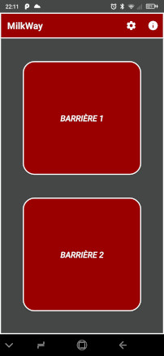
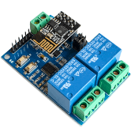
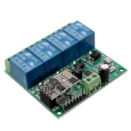
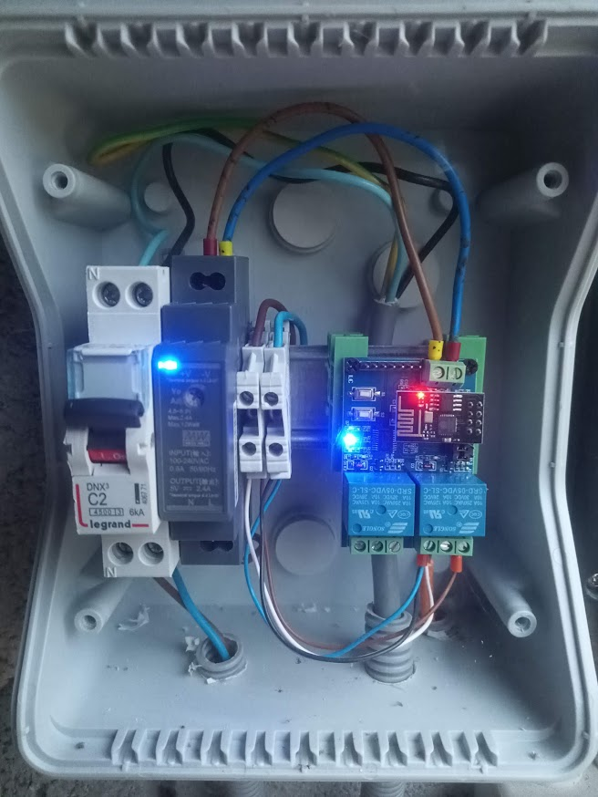

# MilkWay

 

MilkWay est une application Android simple et gratuite qui permet aux agriculteurs de commander leurs barrières verticales Lely Boetech (ou autres) depuis leur smartphone. Grâce à MilkWay, vous ne perdrez plus de temps à rechercher la télécommande de vos barrières pour diriger les vaches vers le robot de traite.

Pour fonctionner, cette application nécéssite l'installation d'une carte de relais Wifi à brancher en parralèle des boutons poussoirs qui commandent les barrières. Cette carte est disponible sur des sites tels que Amazon (pour une livraison rapide), Aliexpress (prix bas mais délai de plusieurs semaines) et bien d'autres. Selon le nombre de barrières à commander, vous aurez besoin d'une carte avec 1, 2 ou 4 relais (courrament appelés relai wifi 2 ou 4 canaux sur les sites marchands). Le prix varie de quelques euros à 25 euros environ. Vous pouvez rechercher ces cartes en tapant "relai ESP8266", "relai wifi 2 canaux", etc sur votre moteur de recherche ou sur le site du revendeur de votre choix. 

Pour l'instant, l'application MilkWay ne fonctionne qu'avec certaines cartes qui doivent absolument contenir un ESP8266 (module ESP-01) et un microcontrolleur STM8S103. Voici les photos des cartes actuellement supportées : 

Ces cartes sont disponibles en alimentation 5V ou 12V selon vos préférences. Vous pouvez utiliser un simple chargeur 5V ou 12V pour alimenter la carte. Vous pouvez également prévoir un petit coffret electrique étanche avec un rail DIN comportant un disjoncteur 2A, un transformateur 5V ou 12V et la carte avec des supports en plastique pour rail DIN. Voici l'exemple d'un cablage pour une porte : 

MilkWay est une application open source sous licence [GPL version 3](LICENSE). Cela signifie que vous êtes libre de télécharger, utiliser et modifier le code source de l'application, sous réserve de respecter les termes de la licence.

Veuillez noter que l'application est fournie en l'état, sans garantie d'aucune sorte. Je ne suis en aucun cas responsable des dommages éventuels sur le matériel de l'utilisateur.
