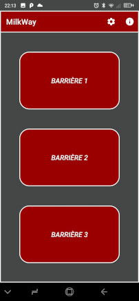

# MilkWay

MilkWay est une application Android simple et gratuite et open source qui permet aux agriculteurs de commander leurs barrières verticales Lely Boetech (ou autres) depuis leur smartphone. Grâce à MilkWay, vous ne perdrez plus de temps à rechercher la télécommande de vos barrières pour diriger les vaches vers le robot de traite.

Contrairement à beaucoup d'applications de commande à distance, celle-ci ne contient pas d'annonces publicitaires et ne collecte pas vos données personnelles.

Voici des captures d'écran de l'application : 

 

## Matériel nécessaire

Pour fonctionner, MilkWay nécéssite l'installation d'une carte de relais Wifi à brancher en parralèle des boutons poussoirs qui commandent les barrières. Pour le moment, l'application ne supporte que certaines cartes qui doivent ***impérativement*** contenir un ESP8266 (dans un module ESP-01) et un microcontrolleur STM8S103. Elles sont commercialisées sous différentes marques comme LC Technology, Dollatek, Daokai, ou autres. Selon le nombre de barrières à commander, vous aurez besoin d'une carte avec 2 ou 4 relais. Le prix varie de quelques euros à 25 euros environ. Vous pouvez rechercher ces cartes en tapant "relai ESP8266", "relai wifi 2 canaux", etc sur votre moteur de recherche ou sur le site du revendeur de votre choix. Parmi les plus connus, on peut citer Amazon, Ebay, AliExpress (prix bas mais délai de plusieurs semaines) mais il y en a bien d'autres.

Voici les photos des cartes actuellement supportées : 

Ces cartes sont disponibles en alimentation 5V ou 12V selon vos préférences. Vous pouvez installer la carte dans une simple boite de dérivation étanche et l'alimenter avec une alimentation de récupération (attention à bien vérifier que les tensions à vide et sous charge soient correctes car certaines alimentations d'entrée de gamme ne sont pas régulées et délivrent une tension trop élevée à faible charge, ce qui risquerait d'endommager la carte). Une alternative un peu plus onéreuse mais plus sérieuse dans un bâtiment d'élevage potentiellement humide et poussiéreux est de faire le montage dans un coffret électrique étanche avec un rail DIN comportant un disjoncteur 2A, un bloc d'alimentation et la carte de relais wifi fixée avec des supports en plastique pour rail DIN. Voici une photo du coffret : 

***Conseil*** : Avant de vous lancer dans l'achat d'un coffret et autres composants, assurez-vous que votre carte fonctionne correctement avec l'application MilkWay en vous référant au paragraphe [#première-mise-en-service](#première-mise-en-service)

## Schéma électrique

Ce schéma électrique est donné à titre d'exemple, libre à vous de l'adapter selon vos besoins : 

## Description de la carte de relais wifi

Il n'est pas très facile de trouver les documentations, voici celle d'une carte de chez LC Technology avec 2 relais alimentée en 5V : [lc-5v-2-channel-wifi-relay-module.pdf](images/lc-5v-2-channel-wifi-relay-module.pdf).

## Première mise en service

Pour la première mise en service, il est conseillé de tester la carte seule sans nécessairement faire le cablâge des relais. 

1. Installer l'application MilkWay sur votre smartphone Android. Celle-ci est disponible sur Google Play. 
2. Alimentez votre carte wifi en 5V ou 12V selon la version de votre carte en veillant à ne pas inverser la polarité.
3. Vérifier après environ 10 secondes que la LED rouge D7 soit allumée et que la led verte D6 clignote à raison de 2 fois par seconde. Dans le cas ou la LED bleue D5 serait allumée, cela signifie que vous êtes dans le mode 2. Si tel était le le cas, appuyez sur le bouton S1 pour changer de mode et recommencez cette étape de vérification des LED.
5. Vous devriez pouvoir vous connecter au réseau wifi de la carte depuis votre smartphone. ***Attention : vous allez peut-être recevoir une notification "Impossible de se connecter à Internet via le réseau wifi". Cliquez sur cette notification puis "Ne plus me demander pour ce réseau" et cliquez sur "Oui". Sinon, cela risquera de ne pas fonctionner correctement*** 
6. Vérifier la bonne connexion de votre smartphone ***au réseau wifi de la carte et non pas au réseau de votre box Internet*** ! 
7. Ouvrir l'application MilkWay et aller dans le menu de configuration de l'application (icône en forme d'engrenage en haut à droite) pour vérifier les paramètres : 
      - Adresse IP ou DNS : 192.168.104.1
      - Numéro de port : 8080
      - Timeout de connexion : 2 sec
      - Nombre de portes : pas plus que le nombre de relais de la carte
9. Retournez sur l'écran d'accueil et testez le bouton Barrière 1. Vous devriez voir un message Barrière 1 OK s'afficher, sinon vérifiez votre connexion Wifi. Vous devriez également entendre le relai changer d'état (ON puis OFF au bout de 300 ms)
10. Faire le même test pour la barrière 2 et éventuellement les autres si vous en avez. 

## Les deux modes de fonctionnement

### Mode 1 : Connexion du smartphone au réseau wifi de la carte

Ce mode de fonctionnement permet de connecter le smartphone directement à la carte de relais wifi. Ce mode est à privilégier si vous n'avez pas de box ou routeur wifi à proximité. Il est fortement conseillé de commencer par ce mode pour vérifier le bon fonctionnement de la carte avec l'application avant de tenter la mise en place du mode 2 un peu plus complexe.

La carte est en mode 1 lorsque la LED rouge D7 est allumée. Appuyer sur le bouton S1 pour changer de mode si besoin. La mise en service de la carte dans ce mode de fonctionnement est détaillé dans le paragraphe [#première-mise-en-service](#première-mise-en-service)

### Mode 2 : Connexion du relai et du smartphone à la box ou au routeur wifi

Ce mode de fonctionnement permet à la carte wifi de se connecter directement à votre box ou à votre routeur wifi. Si vous avez un réseau wifi déjà en place dans votre bâtiment d'élevage, ce mode est à privilégier. Pour paramétrer la carte de relais dans ce mode, il va falloir utiliser une application implémentant le protocole ESPTouch.

> Le protocole ESPTouch (ou Smart Config) est un protocole de configuration sans fil développé par Expressif Systems pour faciliter la configuration de périphériques IoT tels que les modules ESP8266 ou ESP32. Il permet de configurer les paramètres réseau (SSID et mot de passe) d'un périphérique IoT en utilisant une application mobile dédiée, sans avoir à saisir manuellement les informations de connexion. Le protocole ESPTouch est disponible pour les plateformes Android et iOS, ainsi que pour les systèmes d'exploitation Windows et Linux. Il est largement utilisé dans les projets d'IoT pour simplifier la configuration des périphériques et améliorer l'expérience utilisateur.

L'application officielle peut être téléchargée sur le site de Expressif à l'url [https://www.espressif.com/en/products/software/esp-touch/resources](https://www.espressif.com/en/products/software/esp-touch/resources) mais vous pouvez également l'installer depuis le Play Store [https://play.google.com/store/apps/details?id=com.dparts.esptouch](https://play.google.com/store/apps/details?id=com.dparts.esptouch) 

Voici les étapes de configuration : 

1. Prérequis : Etre capable de faire fonctionner les relais dans le mode 1
2. Connecter son smartphone au réseau wifi de votre box ou routeur wifi.
3. Lancer l'application Esptouch et cliquer sur l'item Esptouch (ne pas utiliser la v2)
4. Vérifier les SSID et BSSID et saisir le mot de passe de votre connexion wifi. Laisser l'option Broadcast et Device Count = 1.
5. Passer la carte de relais en mode 2 en appuyant sur le bouton S2 (ou S1 selon le modèle ?) et attendre que la LED bleue D5 soit allumée
6. Cliquer sur le bouton Start et attendre la fin du processus de configuration.
7. Aller sur la page de configuration de votre box pour récupérer l'adresse IP de la carte de relais et paramétrer ce matériel avec une adresse IP fixe de votre choix. Débranchez la carte puis rebranchez.
8. Vérifier sur la page de configuration de votre box que l'adresse IP (pour l'exemple nous choisissons 192.168.1.100) a bien été attribuée à la carte de relais.
9. Ouvrir l'application MilkWay et aller dans le menu de configuration de l'application (icône en forme d'engrenage en haut à droite) pour modifier les paramètres : 
      - Adresse IP ou DNS : saisir l'adresse que vous avez choisi (dans notre exemple : 192.168.1.100)
      - Numéro de port : 8080
      - Timeout de connexion : 2 sec
      - Nombre de portes : pas plus que le nombre de relais de la carte
9. Retournez sur l'écran d'accueil et testez le bouton Barrière 1. Vous devriez voir un message Barrière 1 OK s'afficher, sinon vérifiez votre connexion Wifi. Vous devriez également entendre le relai changer d'état (ON puis OFF au bout de 300 ms)
10. Faire le même test pour la barrière 2 et éventuellement les autres si vous en avez. 

Si cela fonctionne correctement, vous n'aurez plus besoin du programme Esptouch et vous pouvez le désinstaller. 

## Bonus : Commander ses portes depuis n'importe où

Vous pouvez créer un VPN sur votre réseau local (avec par exemple OpenVPN) et y connecter votre smartphone depuis l'extérieur. Cela vous permettra de commander vos barrières oubliées même lorsque que vous n'êtes plus à la ferme. (c'est ici que le timeout de connexion dans le menu de paramètres intervient afin de laisser le temps nécessaire à la bonne connexion selon sa qualité). Il faudra cependant installer une caméra pour visualiser la position des barrières. 

Il est possible de se passer du VPN en utilisant les paramètres NAT de votre box et en utilisant un DNS dynamique (à saisir au lieu de l'adresse IP locale), mais ceci n'est pas du tout sécurisé car n'importe qui pourrait manipuler vos barrières sans authentification.

## Licence et non-responsabilité
MilkWay est une application open source sous licence [GPL version 3](LICENSE). Cela signifie que vous êtes libre de télécharger, utiliser et modifier le code source de l'application, sous réserve de respecter les termes de la licence.

Veuillez noter que l'application est fournie en l'état, sans garantie d'aucune sorte. Je ne suis en aucun cas responsable des dommages éventuels sur le matériel de l'utilisateur.

## Contribuer au projet

Vous avez trouvé un bug dans l'application, vous avez pensé à une évolution ou vous souhaitez participer au codage de l'application ? Alors rendez vous sur la page [CONTRIBUTING](CONTRIBUTING.md).
